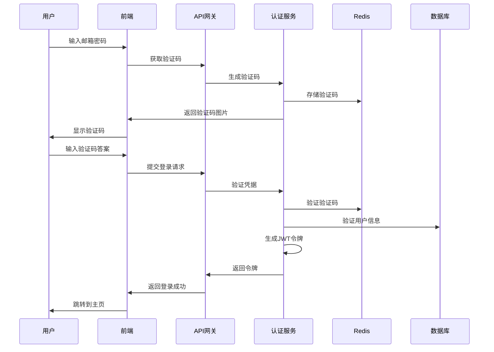
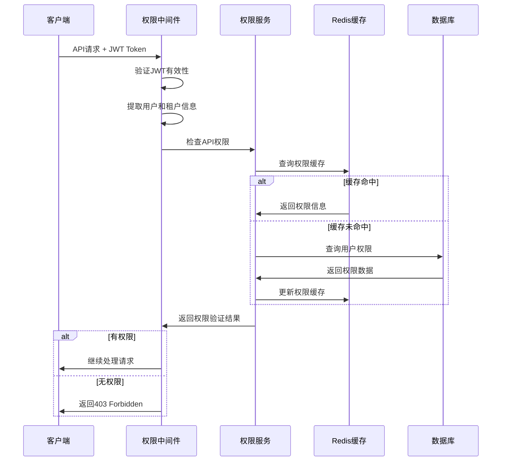

# UltraFit 系统设计文档

本文档提供 UltraFit 项目的完整系统设计，包括业务需求、架构决策、技术选型和实现策略。

## 📋 项目概述

UltraFit 是一个基于 Go 语言的多租户企业级后台管理系统，采用清洁架构设计，集成现代化的开发工具和最佳实践。

### 核心特征
- **多租户架构**: 完整的租户隔离和上下文管理
- **权限管理系统**: 基于 RBAC 的四级权限控制（菜单、按钮、API、字段）
- **现代化技术栈**: Go + Gin + Wire + GORM + MySQL + Redis
- **清洁架构**: 严格的分层设计和依赖倒置
- **可观测性**: 完整的日志、监控和分布式追踪

## 🎯 业务需求

### 用户角色定义

#### 1. 系统管理员 (System Admin)
**职责**: 管理整个 SaaS 平台
- 创建、删除、管理租户
- 查看系统级监控数据和报告
- 管理系统配置和基础设施
- 查看所有审计日志和安全事件

#### 2. 租户管理员 (Tenant Admin)
**职责**: 管理特定租户的资源和用户
- 管理租户内的用户账户
- 分配租户内的角色和权限
- 查看租户级别的审计日志
- 配置租户特定的业务规则

#### 3. 普通用户 (User)
**职责**: 使用系统功能和访问授权资源
- 访问被授权的功能模块
- 查看和编辑被授权的数据
- 管理个人信息和偏好设置

### 核心功能需求

#### 认证系统
- **用户认证**: 邮箱 + 密码登录，JWT 令牌管理
- **会话管理**: 支持会话超时、主动登出、令牌刷新
- **安全保护**: 图形验证码、登录失败锁定、密码强度验证
- **密码安全**: bcrypt 加密存储，支持密码重置

#### 权限控制
- **RBAC 模型**: 基于角色的访问控制
- **四级权限**: 菜单、按钮、API、字段级别的精细化权限
- **动态权限**: 支持运行时权限验证和动态权限分配
- **权限继承**: 通过 parent_code 建立权限层次关系

#### 多租户管理
- **租户隔离**: 基于 tenant_id 的行级数据隔离
- **租户切换**: 系统管理员可无缝切换管理不同租户
- **资源配额**: 支持租户级别的资源限制和配额管理
- **租户生命周期**: 租户创建、配置、暂停、删除等完整生命周期

## 🏗️ 系统架构

### 清洁架构设计

```
         外部接口层
    ┌─────────────────────┐
    │   HTTP Handlers     │  ← Web API、参数验证、响应格式化
    └─────────────────────┘
              ↓
         应用服务层
    ┌─────────────────────┐
    │   Service Layer     │  ← 业务逻辑、用例编排、事务管理
    └─────────────────────┘
              ↓
         数据访问层
    ┌─────────────────────┐
    │  Repository Layer   │  ← 数据访问抽象、查询封装
    └─────────────────────┘
              ↓
         领域模型层
    ┌─────────────────────┐
    │    Model Layer      │  ← 数据模型、业务实体
    └─────────────────────┘
```

### 多租户架构模型

```
系统层 (tenant_id = 0)
├── 系统管理员
│   ├── 租户管理权限
│   ├── 系统监控权限
│   └── 全局配置权限
└── 跨租户操作能力

租户层 (tenant_id > 0)
├── 租户管理员
│   ├── 用户管理权限
│   ├── 角色管理权限
│   └── 租户配置权限
└── 租户数据隔离边界
```

### 技术架构栈

| 层级 | 技术选型 | 职责 |
|------|----------|------|
| **Web 框架** | Gin | HTTP 路由、中间件、请求处理 |
| **依赖注入** | Wire | 编译时依赖注入、代码生成 |
| **数据访问** | GORM | ORM 映射、数据库操作 |
| **数据存储** | MySQL | 主数据库存储 |
| **缓存层** | Redis | 验证码、会话、权限缓存 |
| **日志追踪** | Zap + OpenTelemetry | 结构化日志、分布式追踪 |
| **配置管理** | Viper | 多环境配置管理 |
| **测试框架** | Testify + Gomock | 单元测试、集成测试 |

## 🔒 安全架构

### 认证机制

**JWT 令牌结构**:
```json
{
  "user_id": "user_uuid",
  "tenant_id": "tenant_uuid", 
  "email": "user@example.com",
  "roles": ["admin", "user"],
  "permissions": ["user:read", "user:write"],
  "exp": 1704067200,
  "iat": 1704063600
}
```

**认证流程**:
1. 用户提交邮箱、密码、验证码
2. 验证用户凭据和验证码有效性
3. 生成 JWT 访问令牌和刷新令牌
4. 返回令牌和用户基本信息
5. 后续请求携带 Bearer Token 进行认证

### 权限控制模型

**四级权限体系**:
```
1. 菜单权限 (Menu)     → 控制页面访问
2. 按钮权限 (Button)   → 控制操作显示  
3. API权限 (API)       → 控制接口访问
4. 字段权限 (Field)    → 控制数据字段访问
```

**权限验证流程**:
```go
HTTP Request → AuthMiddleware → JWT验证 → 用户上下文 
    → PermissionMiddleware → 权限验证 → 业务处理
```

### 多租户安全

**数据隔离策略**:
- 所有用户数据表包含 `tenant_id` 字段
- 数据库查询自动添加租户过滤条件
- JWT 令牌包含租户上下文信息
- 中间件层面强制租户边界检查

**租户切换安全**:
- 验证用户对目标租户的访问权限
- 通过 HTTP Header `X-Tenant-ID` 传递租户标识
- 保持原有 JWT 令牌有效性，无需重新认证

## 💾 数据架构

### 核心数据模型

**租户模型**:
```go
type Tenant struct {
    ID         uint64    `gorm:"primarykey"`
    UUID       string    `gorm:"uniqueIndex;not null"`
    Name       string    `gorm:"not null"`
    Domain     string    `gorm:"uniqueIndex"`
    Status     string    `gorm:"default:active"`
    MaxUsers   int       `gorm:"default:10"`
    MaxStorage int64     `gorm:"default:1073741824"` // 1GB
    CreatedAt  time.Time
    UpdatedAt  time.Time
}
```

**用户模型**:
```go
type User struct {
    ID          string    `gorm:"primarykey"`
    TenantID    string    `gorm:"not null;index"`
    Email       string    `gorm:"uniqueIndex;not null"`
    Name        string    `gorm:"not null"`
    Password    string    `gorm:"not null"`
    Status      string    `gorm:"default:active"`
    LastLoginAt *time.Time
    CreatedAt   time.Time
    UpdatedAt   time.Time
}
```

**权限模型**:
```go
type Permission struct {
    ID          uint64 `gorm:"primarykey"`
    Code        string `gorm:"uniqueIndex;not null"`
    Name        string `gorm:"not null"`
    Type        string `gorm:"not null"` // menu,button,api,field
    Scope       string `gorm:"not null"` // system,tenant
    ParentCode  string `gorm:"index"`
    Module      string `gorm:"not null"`
    Description string
    IsBuiltin   bool `gorm:"default:false"`
    IsActive    bool `gorm:"default:true"`
}
```

### 数据库设计原则

1. **无物理外键**: 通过业务逻辑维护数据一致性
2. **字符串枚举**: 使用 VARCHAR 而非 MySQL ENUM 类型
3. **软删除支持**: 所有表包含 `deleted_at` 字段
4. **审计字段**: 创建时间、更新时间、操作人记录
5. **UUID 标识**: 对外使用 UUID，内部使用自增 ID

## 🔄 业务流程

### 用户登录流程



### 权限验证流程



## 🎮 部署架构

### 开发环境
```
┌─────────────────┐
│   开发者本机     │
├─────────────────┤
│ Go 应用服务      │
│ MySQL 数据库     │
│ Redis 缓存       │
│ 本地配置文件     │
└─────────────────┘
```

### 生产环境
```
┌─────────────┐   ┌─────────────┐   ┌─────────────┐
│  负载均衡器  │   │  应用集群    │   │  数据存储    │
├─────────────┤   ├─────────────┤   ├─────────────┤
│   Nginx     │──▶│ Go App Pods │──▶│   MySQL     │
│   SSL 终结  │   │ 自动扩缩容   │   │   Redis     │
│   速率限制   │   │ 健康检查     │   │   备份恢复   │
└─────────────┘   └─────────────┘   └─────────────┘
```

## 📊 性能设计

### 性能目标

| 指标 | 目标值 | 说明 |
|------|--------|------|
| API响应时间 | < 200ms | P95 响应时间 |
| 数据库查询 | < 50ms | 单个SQL查询时间 |
| 权限验证 | < 5ms | 权限检查延迟 |
| 并发用户 | 1000+ | 支持并发用户数 |
| 系统可用性 | 99.9% | 年度系统可用性 |

### 性能优化策略

**缓存策略**:
- Redis 缓存用户权限信息 (TTL: 30分钟)
- 验证码临时存储 (TTL: 5分钟)
- JWT 黑名单缓存 (TTL: Token过期时间)

**数据库优化**:
- 基于 tenant_id 的分区策略
- 关键字段索引优化
- 读写分离和连接池管理
- 慢查询监控和优化

**应用层优化**:
- Wire 编译时依赖注入，零运行时开销
- Goroutine 池管理，避免无限制创建
- HTTP Keep-Alive 和连接复用
- 结构化日志，减少序列化开销

## 🔍 监控与运维

### 可观测性架构

**日志管理**:
- 结构化日志 (JSON 格式)
- 自动 TraceID 注入
- 错误日志聚合分析
- 审计日志长期保存

**指标监控**:
- 业务指标：用户活跃度、权限操作频率
- 技术指标：API 延迟、错误率、吞吐量
- 系统指标：CPU、内存、磁盘、网络

**分布式追踪**:
- OpenTelemetry 标准实现
- 请求链路完整追踪
- 跨服务调用分析
- 性能瓶颈定位

### 运维策略

**部署策略**:
- 蓝绿部署最小化停机时间
- 金丝雀发布降低风险
- 自动回滚机制
- 配置热更新

**备份恢复**:
- 数据库每日自动备份
- 关键配置版本控制
- 灾难恢复演练
- 数据恢复时间目标 < 4小时

## 📚 相关文档

- **[技术架构详解](./core/)** - 深入的技术架构设计
- **[业务架构设计](./business/)** - 业务域和权限架构
- **[开发指南](../development/)** - 开发规范和最佳实践
- **[API 文档](../api/)** - 完整的 API 规范

---

**设计决策记录**: 本文档记录了关键的架构决策和设计权衡，为系统演进提供参考依据。